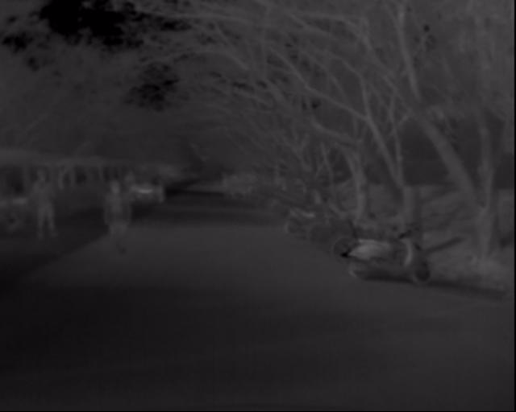
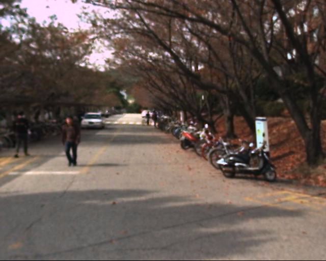
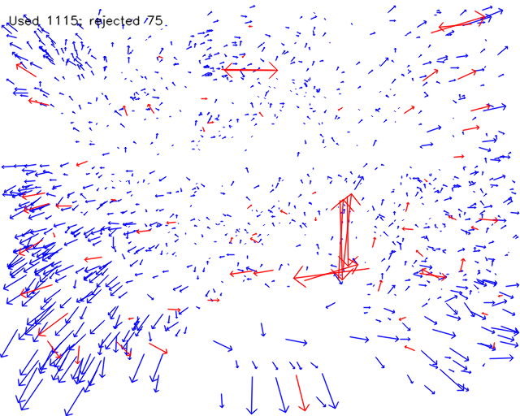
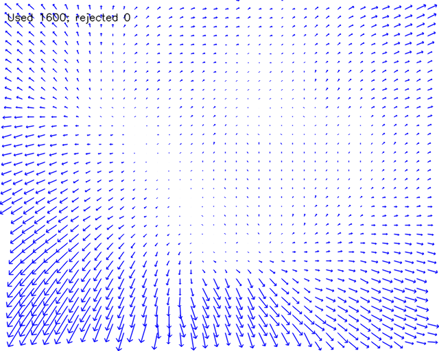

# Multiespectral correction

This set of scripts is intended to check and correct mialignments and distortion issues when working with multiespectral images that have been taken with different cameras and are not calibrated. 

## Scripts available:

- [ ] `review_image_corresp_handeye.py`: This tool lets you match manually corresponding pairs of points between images.
- [ ] `review_image_corresp_descriptor.py`: This tool lets you check corresponding pairs of points between images making use of image point descriptors. (not working well at all)
- [ ] `compute_image_corresopndance.py`: Making use of the point-matching-pairs from any of the previous scripts it computes the transformation needed to match one of the images to the other one.
- [ ] `project_images.py`: Small script that projects both images (in its original and in its corrected version) to check the changes. It includes an alpha selector.

## Toolchain

In some multiespectral datasets it might happen that images do not match in terms of distortion. As usually we don't have access to the camera nor to the calibration data (which would be the ideal). As we have two images some calibration might be corrected based on matching points between both of them.

In this case we will compute the relative distortion of LWIR image with regards to RGB image.

    <figure style="display: inline-block; text-align: center; margin: 0 10px;">
        
        <figcaption>LWIR Image Used as Reference</figcaption>
    </figure>
    <figure style="display: inline-block; text-align: center; margin: 0 10px;">
        
        <figcaption>RGB Image Used as Reference</figcaption>
    </figure>

With any of the `review_image_corresp_*.py` scripts we will match corresponding points between both images. The script goes iteratively over the dataset picking random images (without repetition), so its not very important to have a lot of points in a single image-pair, only those that are a sure match.

Once we have enough points we can apply some filter to them (we have to tackle possible human error in the tagging) an interpolate a grid of distortion vectors between images (a distortion vector has a starting point with the coordinates in LWIR image and an arrow reaching the matching point coordinates in RGB image):

    <figure style="display: inline-block; text-align: center; margin: 0 20px;">
        
        <figcaption>Raw distortion vectors from tagged data. In red vectors that are filtered and won't be used.</figcaption>
    </figure>
    <figure style="display: inline-block; text-align: center; margin: 0 20px;">
        
        <figcaption>Interpolated grid of distortion vectors to be used</figcaption>
    </figure>

With this filtered matching point grid we can perform a calibration of the relative distortion between both images and hope to correct it as much as possible.
